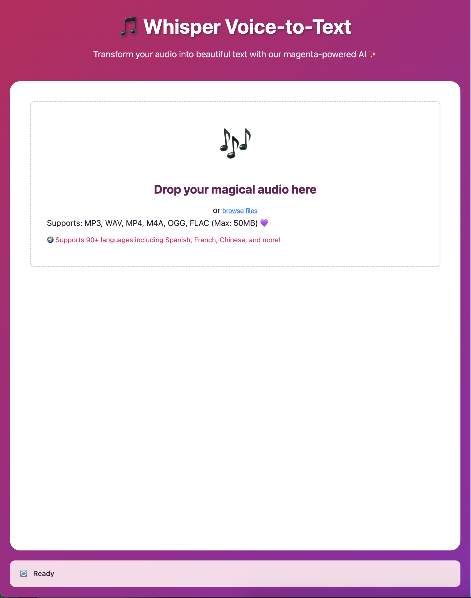
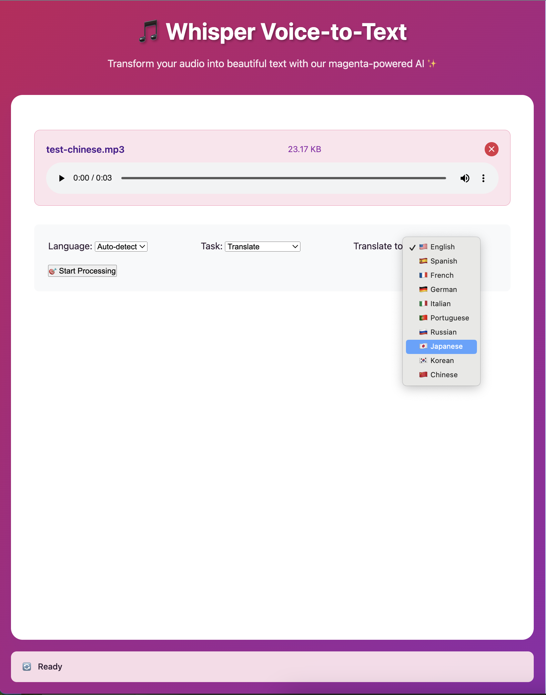
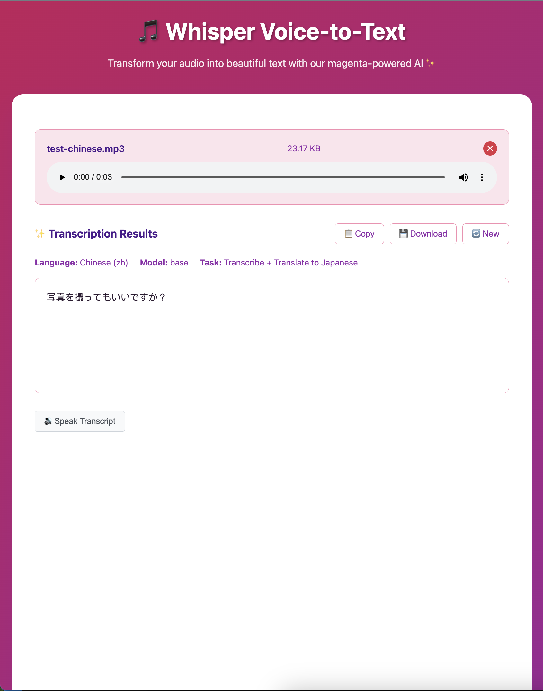

## Project Purpose

This project delivers a **scalable, dockerized voice-to-text and translation web service**. It leverages the open-source [OpenAI Whisper](https://github.com/openai/whisper) LLM for speech recognition, Google Translate (on-premises or via API) for text translation, and a TTS (Text-to-Speech) microservice for speech synthesis. All services are containerized for easy deployment, scalability, and maintainability.

**Approach:**
- **Whisper**: Converts uploaded audio to text, supporting 90+ languages.
- **Google Translate**: Translates transcribed text to any supported language, running on-premises for privacy and control.
- **TTS Service**: Converts text to speech using various voices.
- **Docker**: Each service runs in its own container for isolation and scalability.

---

## System Overview Diagram

```
+-------------------+      +-------------------+      +-------------------+
|                   |      |                   |      |                   |
|   Frontend (Web)  +----->+   Whisper API     +----->+   TTS Service     |
|                   |      |                   |      |                   |
+-------------------+      +-------------------+      +-------------------+
         |                        |                        |
         |                        |                        |
         |                        |                        |
         +------------------------+------------------------+
                                  |
                        +-------------------+
                        |                   |
                        | Google Translate  |
                        |   (On-premises)   |
                        +-------------------+
```

---

## Folder Structure

```
voice-to-text/
├── backend/
│   ├── whisper_api/        # Whisper REST API (Flask)
│   ├── tts_service/        # TTS REST API (Flask or FastAPI)
│   ├── translation/        # Google Translate integration
│   ├── Dockerfile          # Backend Dockerfile
│   ├── requirements.txt
│   └── *.sh                # Shell scripts for setup/debug
├── frontend/
│   ├── src/
│   │   ├── index.html      # Main UI
│   │   ├── css/
│   │   ├── js/
│   │   │   ├── app.js      # Main app logic
│   │   │   ├── api.js      # Whisper API client
│   │   │   ├── audio.js    # Audio utilities
│   │   │   ├── language-config.js      # Language selection pulldown menu
│   │   │   ├── tts.js      # TTS client
│   └── Dockerfile          # Frontend Dockerfile
├── tests/                  # Test scripts and documentation
│   ├── test_*.sh           # Integration and health check tests
│   ├── debug_*.sh          # Debugging scripts
│   └── README.md           # Test documentation
├── docker-compose.yml      # Multi-service orchestration
└── README.md
```

---

## Frontend Architectural Design

- **index.html**: UI layout, buttons, and containers for upload, options, progress, results, TTS, status, toast, and error modal.
- **app.js**: Main controller, event handling, state management, UI updates.
- **api.js**: Handles communication with Whisper backend.
- **audio.js**: Audio file validation and preview.
- **tts.js**: Handles TTS service requests.

### UI Button Functions

- **Browse Files**: Opens file picker for audio upload.
- **Remove File (✕)**: Clears selected audio and resets UI.
- **Transcribe/Translate**: Starts Whisper transcription or translation.
- **Speak Transcript**: Sends transcript to TTS service and plays audio.
- **Copy**: Copies transcript to clipboard.
- **Download**: Downloads transcript as .txt file.
- **New**: Resets the app for a new session.
- **Download Audio (TTS)**: Downloads synthesized speech as .mp3.
- **Clear Audio (TTS)**: Removes TTS audio from UI.

---

## Backend Architectural Design

### Whisper API (Flask)

- **Endpoints:**
    - `POST /api/v1/transcribe`: Transcribes uploaded audio.
    - `POST /api/v1/translate`: Translates text.
    - `GET /api/v1/languages`: Lists supported languages.
    - `GET /api/v1/model`: Model info.
    - `GET /health`: Health check.

### TTS Service (Flask or FastAPI)

- **Endpoints:**
    - `POST /synthesize`: Synthesizes speech from text.
    - `GET /download/<audio_id>`: Downloads generated audio.
    - `DELETE /cleanup/<audio_id>`: Removes audio file.
    - `GET /voices`: Lists available voices.
    - `GET /health`: Health check.

### Translation Service

- Uses Google Translate API via Python client, running on-premises.
- Called internally by Whisper API for translation tasks.

---

## API Documentation (with Examples)

### Whisper API

**Transcribe Audio**
```bash
curl -X POST http://localhost:5000/api/v1/transcribe \
  -F "audio=@sample.mp3" \
  -F "language=en" \
  -F "task=transcribe"
```
**Response:**
```json
{
  "result": {
    "text": "Hello world",
    "language": "en",
    "model_size": "base",
    "segments": [...]
  }
}
```

**Translate Text**
```bash
curl -X POST http://localhost:5000/api/v1/translate \
  -H "Content-Type: application/json" \
  -d '{"text": "Hello world", "target_language": "es"}'
```
**Response:**
```json
{
  "result": {
    "translated_text": "Hola mundo"
  }
}
```

**Get Languages**
```bash
curl http://localhost:5000/api/v1/languages
```
**Response:**
```json
{ "languages": ["en", "es", ...] }
```

**Get Model Info**
```bash
curl http://localhost:5000/api/v1/model
```
**Response:**
```json
{ "model_info": { "model_size": "base", ... } }
```

### TTS Service

**Synthesize Speech**
```bash
curl -X POST http://localhost:7000/synthesize \
  -H "Content-Type: application/json" \
  -d '{"text": "Hello world", "voice": "en-US-gtts"}'
```
**Response:**
```json
{ "audio_id": "abc123" }
```

**Download Audio**
```bash
curl http://localhost:7000/download/abc123 --output speech.mp3
```
**Response:** (audio/mpeg file)

**Cleanup Audio**
```bash
curl -X DELETE http://localhost:7000/cleanup/abc123
```
**Response:**
```json
{ "status": "deleted" }
```

---

## Benefits of Implementation

- **Scalable**: Each service runs in its own container, can be scaled independently.
- **Maintainable**: Clear separation of concerns (frontend, whisper, tts, translation).
- **Extensible**: Easy to add new languages, voices, or models.
- **Open Source**: Leverages Whisper and Google APIs.
- **User-Friendly**: Simple drag-and-drop UI, instant feedback, multi-language support.

---

## Example Function Explanations

**Transcribe Button Handler (app.js):**
```javascript
async startTranscription() {
    // Validates file, sends to Whisper API, updates UI with results
}
```

**TTS Synthesis (tts.js):**
```javascript
async synthesize(text, voice = 'en-US-gtts') {
    // POSTs text to TTS service, returns audio_id
}
```

**Download Transcript (app.js):**
```javascript
downloadResults() {
    // Creates .txt file from transcript and triggers download
}
```

---

## Setup Instructions

### 1. Clone the Repo

```bash
git clone https://github.com/your-org/voice-to-text.git
cd voice-to-text
```

### 2. Build and Start All Services

```bash
docker-compose up --build
```

### 3. Build Individually

```bash
docker build -t whisper_api ./backend/whisper_api
docker build -t tts_service ./backend/tts_service
docker build -t frontend ./frontend
```

### 4. Start Individually

```bash
docker run -p 5000:5000 whisper_api
docker run -p 7000:7000 tts_service
docker run -p 8080:80 frontend
```

### 5. Use docker-compose

```bash
docker-compose up
```

### 6. Debug Individual Services

- **Frontend**:
    ```bash
    docker-compose up frontend
    ```
- **Whisper API**:
    ```bash
    docker-compose up whisper_api
    ```
- **TTS Service**:
    ```bash
    docker-compose up tts_service
    ```

### 7. Trace Logs

```bash
docker-compose logs -f whisper_api
docker-compose logs -f tts_service
docker-compose logs -f frontend
```

---

## Shell Script (.sh) Explanations

- **build.sh**: Builds Docker images for all services.
    ```bash
    #!/bin/bash
    docker-compose build
    ```
- **start.sh**: Starts all containers using docker-compose.
    ```bash
    #!/bin/bash
    docker-compose up
    ```
- **stop.sh**: Stops and removes all containers.
    ```bash
    #!/bin/bash
    docker-compose down
    ```
- **logs.sh**: Tails logs for all services.
    ```bash
    #!/bin/bash
    docker-compose logs -f
    ```

## Testing

Comprehensive test scripts are available in the `tests/` folder:

```bash
cd tests
./final_tts_test.sh        # Full TTS integration test
./test_microservices.sh    # All microservices test
./test_simple.sh           # Basic functionality test
```

See `tests/README.md` for complete documentation of all available test scripts.

---

## Summary

This project provides a robust, scalable, and user-friendly voice-to-text and translation platform using state-of-the-art open-source AI and cloud APIs. The dockerized architecture ensures easy deployment and scaling, while the modular design allows for future enhancements and maintenance. The UI is intuitive, and every button/action is mapped to a backend service for seamless user experience.

### Main Screen


### Language Options


### Translate or transcribe an audio file
